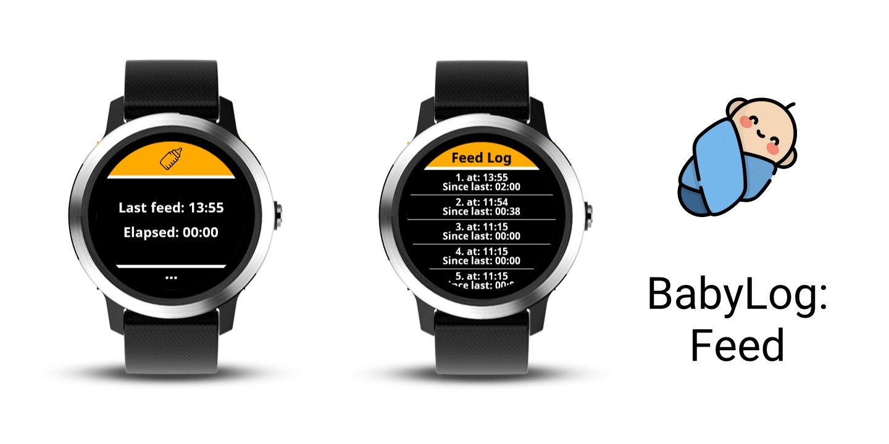
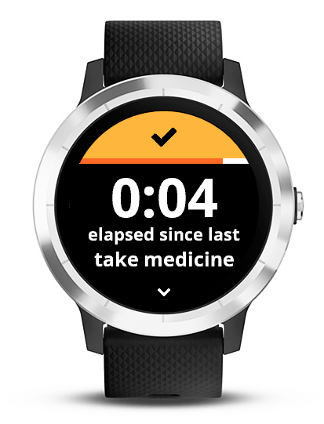
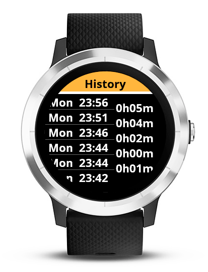

A Widget for Garmin ConnectIQ (currently: VivoActive3 / Music)

## Intention
This is a simple widget used to mark / log the times you feed your baby.
I created this during my parental leave to help me remember when the baby had his last meal.

The data is directly stored on the device.
The last 10 feeds are stored.

## Use
- Tap on the yellow button at the top to add a new feed time
- Tap on the three dots at the bottom to open the log screen with the ten last feed times.
- On the second screen:
-- Scroll up and down to see all ten entries
-- Swipe left to go back

## Screenshots



## Develop
- Install JDK8
- Install Garmin ConnectIQ SDK
- Create file `properties.mk` in project root. Follow the guide at https://github.com/danielsiwiec/garmin-connect-seed
- Run `make run` to run in simulator and `make deploy` to deploy on watch.

### Install JDK8 on macOS

```
brew tap AdoptOpenJDK/openjdk
brew cask install adoptopenjdk8
brew install jenv   # add follow the console output to setup your shell
```

Following instruction on https://github.com/jenv/jenv to setup `jenv` 

Set to use JDK8 in this project:

```
jenv local 1.8
```

## Credits
- Originate from the [BabyLog:Feed](https://github.com/tanstaaflFH/BabyLog-Feed-ConnectIQ) app made by [Falko Hegewald](fh.development@zoho.eu).
- Done icon: <div>Icons made by <a href="https://www.flaticon.com/authors/dave-gandy" title="Dave Gandy">Dave Gandy</a> from <a href="https://www.flaticon.com/" title="Flaticon">www.flaticon.com</a></div>
